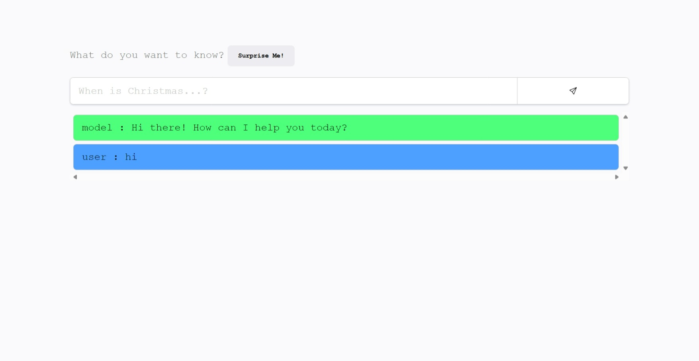

# GenieTalks

GenieTalks is a chatbot application that utilizes the Gemini API to provide intelligent responses to user queries. The project consists of a client and server setup. The client is built with Vite and connects to an Express server which handles API requests to the Gemini API.

## Table of Contents

- [Features](#features)
- [Live Demo](#live-demo)
- [Installation](#installation)
- [Environment Variables](#environment-variables)
- [Usage](#usage)
- [Technologies Used](#technologies-used)
- [Contributing](#contributing)
- [License](#license)

## Features

- Ask questions and get intelligent responses.
- Surprise me feature for random queries.
- View chat history.
- Clear chat history.

## Live Demo

Check out the live demo of GenieTalks [here](https://genietalks.vercel.app).

## Installation

### Prerequisites

- Node.js (v14 or higher)
- npm or yarn

### Steps

1. Clone the repository:
    ```bash
    git clone https://github.com/aayushsiwa/genietalks.git
    cd genietalks
    ```

2. Install dependencies for the client:
    ```bash
    cd client
    npm install
    ```

3. Install dependencies for the server:
    ```bash
    cd ../server
    npm install
    ```

## Environment Variables

### Client

Create a `.env` file in the `client` directory with the following content:
```
VITE_API_URL=http://localhost:5000/gemini
```

### Server

Create a `.env` file in the `server` directory with the following content:
```
API_KEY=your_gemini_api_key
```

## Usage

### Running the Server

Navigate to the `server` directory and start the server:
```bash
npm start
```

The server will start on `http://localhost:5000`.

### Running the Client

Navigate to the `client` directory and start the client:
```bash
npm run dev
```

The client will start on `http://localhost:5173` (default Vite port).

## Technologies Used

- **Client:** React, TypeScript, Vite
- **Server:** Express, TypeScript, Google Generative AI API, dotenv, morgan, helmet, cors

## Contributing

Contributions are welcome! Please feel free to submit a Pull Request.

1. Fork the repository.
2. Create a new branch (`git checkout -b feature-branch`).
3. Commit your changes (`git commit -m 'Add some feature'`).
4. Push to the branch (`git push origin feature-branch`).
5. Open a Pull Request.

## License

This project is licensed under the MIT License. See the [LICENSE](LICENSE) file for details.

